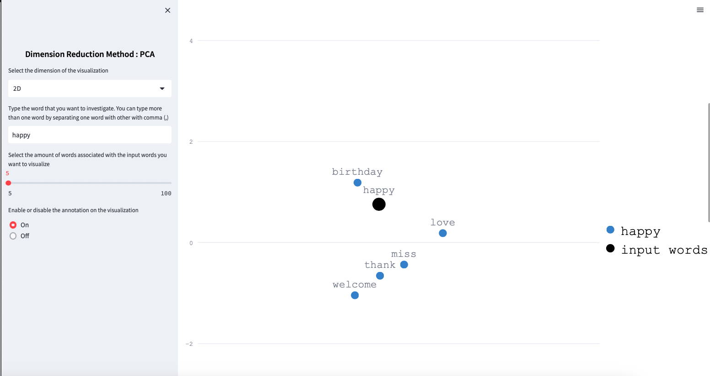

# Word-Embeding
단어를 입력받아 유의어를 공간 차원에 표현한다.
 

### 배포 사이트
[Streamlit APP](https://holly-21-word-embeding-test-streamlit-01gc7i.streamlit.app/)

 

### 실행(로컬)

1. requirements.txt를 먼저 실행시켜서 필요한 라이브러리 준비
2. train_word_embedding.py를 실행 전, 아래 링크에서 훈련데이터를 먼저 받아서 로컬에 저장 
   glove.6B.zip을 다운 
[Steamlit OPEN API](https://medium.com/@avra42/summarizing-scientific-articles-with-openai-and-streamlit-fdee12aa1a2b)
4. `streamlit run test_streamlit.py` 로 실행

 

### OUTPUT
최종 결과물

'happy' 단어를 입력했을 경우, 2차원 공간에서 유의어를 표현한다.

'happy' 단어와의 유사도

'happy'와의 유사도를 유의어 개수를 증가하여 3D 공간에 표현.

 

### 참고자료
[Visualizing Word Embedding with PCA and t-SNE](https://towardsdatascience.com/visualizing-word-embedding-with-pca-and-t-sne-961a692509f5)
